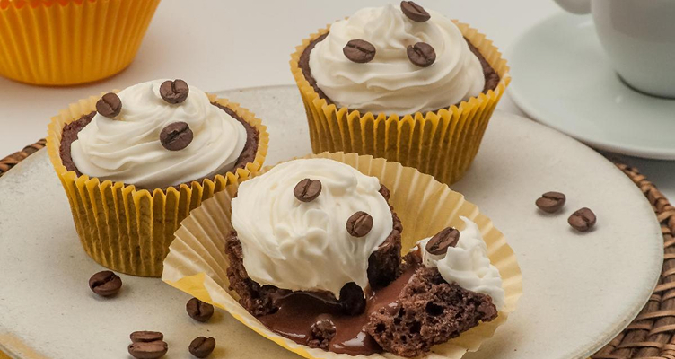

<h1 align="center"> Cupcake de café com chantilly 🧁☕ </h1>

  
  

  <a href="#-projeto">Projeto</a>&nbsp;&nbsp;&nbsp;|&nbsp;&nbsp;&nbsp;
  <a href="#-tecnologias">Tecnologias</a>&nbsp;&nbsp;&nbsp;|&nbsp;&nbsp;&nbsp;
  <a href="#-aprendizados">Aprendizados</a>&nbsp;&nbsp;&nbsp;|&nbsp;&nbsp;&nbsp;
  <a href="#-layout">Layout</a>

 

  

## 🚀 Projeto

Este projeto é uma página web de uma receita de **Cupcake de café com chantilly**. O objetivo foi praticar a estruturação de conteúdo com HTML e a estilização básica de textos, listas e imagens com CSS.

Este foi um dos exercícios práticos do curso **Explorer da Rocketseat**, focado nos fundamentos do desenvolvimento web.

🔗 **Acesse o projeto online:** [Clique aqui para visualizar](https://matheus-nerisxavier.github.io/pagina-de-receita/)

## 💻 Tecnologias

Esse projeto foi desenvolvido com as seguintes tecnologias:

-   **HTML5**: Estruturação semântica do conteúdo (listas, textos, imagens).
-   **CSS3**: Estilização de cores, tipografia e layout básico.
-   **Git e GitHub**: Versionamento de código e publicação.

## 🧠 Aprendizados

Durante o desenvolvimento deste projeto, pude praticar conceitos importantes como:

-   **Estrutura HTML**: Uso correto de tags de título, parágrafos e imagens (``).
-   **Listas**: Aplicação de listas não ordenadas (`<ul>`) para ingredientes e ordenadas (`<ol>`) para o modo de preparo.
-   **Estilização Básica**: Uso de cores de fundo, cores de texto, bordas arredondadas e centralização de conteúdo.
-   **Box Model Básico**: Margens internas (padding) e externas (margin) para dar respiro ao layout.

## 🎨 Layout

O layout foi desenvolvido com base nos materiais didáticos e desafios da **Rocketseat**.

## 📝 Licença

Esse projeto está sob a licença MIT.

---

Feito com 💜 por Matheus Neris Xavier durante a jornada Explorer.
